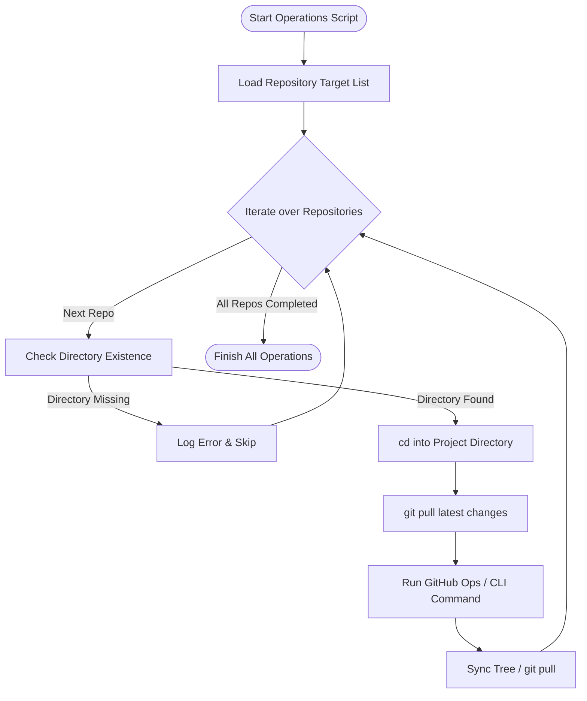

<div align="center">

# ⚙️ `my-ops-codes`

**Automated DevOps scripts, batch repository managers, and GitHub workflow orchestrators.**

[](LICENSE)
[](https://www.gnu.org/software/bash/)
[](#)
[](#)

<p align="center">
  <a href="#-overview">Overview</a> •
  <a href="#-key-features">Key Features</a> •
  <a href="#-architecture--flow">Architecture</a> •
  <a href="#-repository-structure">Repository Structure</a> •
  <a href="#-getting-started">Getting Started</a> •
  <a href="#-configuration--security">Security & Config</a> •
  <a href="#-license">License</a>
</p>

---

</div>

## 📌 Overview

`my-ops-codes` is a centralized operational suite designed for automated, bulk management of multi-repository ecosystems on GitHub. It streamlines repetitive multi-repo administration tasks such as enabling repository features (e.g. GitHub Discussions), syncing git upstream branches, and enforcing configurations across dozens of projects seamlessly.

---

## ✨ Key Features

- 🔁 **Batch Multi-Repository Execution**: Run batch operations across 150+ repositories sequentially with automated directory validation and error containment.
- 💬 **Feature Automation**: Programmatically toggle and configure GitHub features like Discussions, Tabs, Branch Protections, and PR policies.
- 🔄 **Autonomous Git Synchronization**: Automatically pull latest changes before and after operational updates to maintain clean tree states.
- 🧩 **Modular & Extensible**: Easily add custom scripts for repository analytics, issue templating, asset distribution, or mass linting.

---

## 🏗 Architecture & Flow



---

## 📂 Repository Structure

```
my-ops-codes/
├── .github/
│   └── FUNDING.yml         # GitHub sponsorship configuration
├── loop_discus.sh          # Batch script for enabling Discussions & syncing repos
├── .gitignore              # Ignored files & secrets
├── LICENSE                 # MIT License
└── README.md               # Repository documentation & guide
```

---

## 🚀 Getting Started

### Prerequisites

Ensure you have the following installed on your system:

- **Bash** (Git Bash, WSL, or native Linux/macOS terminal)
- **Git** configured and authenticated
- **Node.js / NPM** (for relevant GitHub CLI tools like [`github-tabs`](https://github.com))

### Installation & Setup

1. **Clone the repository:**
   ```bash
   git clone https://github.com/ishandutta2007/my-ops-codes.git
   cd my-ops-codes
   ```

2. **Configure Environment Variables:**
   For security, avoid hardcoding tokens directly into scripts. Set your GitHub Personal Access Token (PAT) in your environment:
   ```bash
   export GITHUB_TOKEN="ghp_yourPersonalAccessTokenHere"
   export ADMIN_TOKEN="ghp_yourAdminTokenHere"
   export PROJECTS_ROOT="/path/to/your/projects"
   ```

3. **Make scripts executable:**
   ```bash
   chmod +x *.sh
   ```

### Running Batch Scripts

To execute the discussion batch enabler:
```bash
./loop_discus.sh
```

---

## 🔐 Configuration & Security Best Practices

> [!IMPORTANT]
> **Token Security**: Always ensure sensitive tokens (such as `GITHUB_TOKEN` and `ADMIN_TOKEN`) are loaded via environment variables or secret vaults rather than committed directly into version control.

Recommended configuration snippet pattern:
```bash
#!/usr/bin/env bash

root_path="${PROJECTS_ROOT:-$HOME/Projects}"
ADMIN_TOKEN="${ADMIN_TOKEN:-$GITHUB_TOKEN}"

if [ -z "$ADMIN_TOKEN" ]; then
  echo "Error: ADMIN_TOKEN is not set."
  exit 1
fi
```

---

## 🤝 Contributing

Contributions, issues, and feature requests are welcome!

1. Fork the Project
2. Create your Feature Branch (`git checkout -b feature/AmazingFeature`)
3. Commit your Changes (`git commit -m 'Add some AmazingFeature'`)
4. Push to the Branch (`git push origin feature/AmazingFeature`)
5. Open a Pull Request

---

## 📄 License

Distributed under the [MIT](LICENSE) License. See `LICENSE` for more information.

<div align="center">
  <sub>Built with ❤️ for automated Git operations and DevOps efficiency.</sub>
</div>
